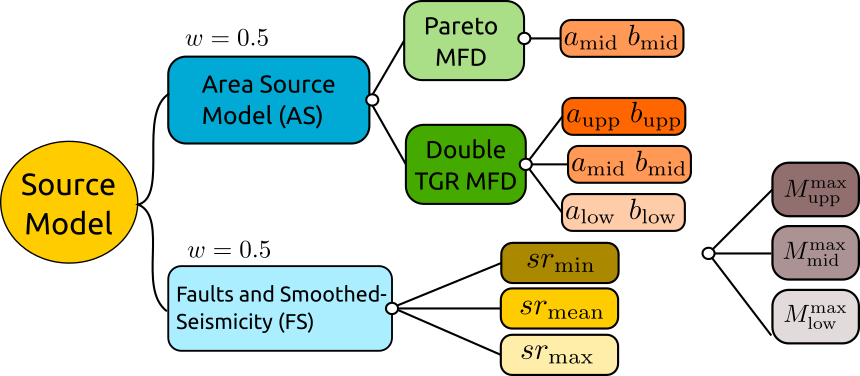
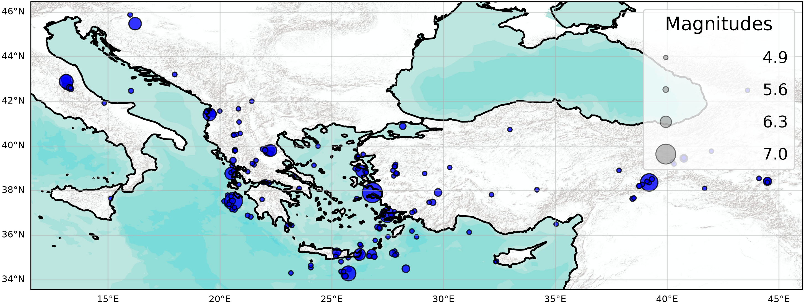
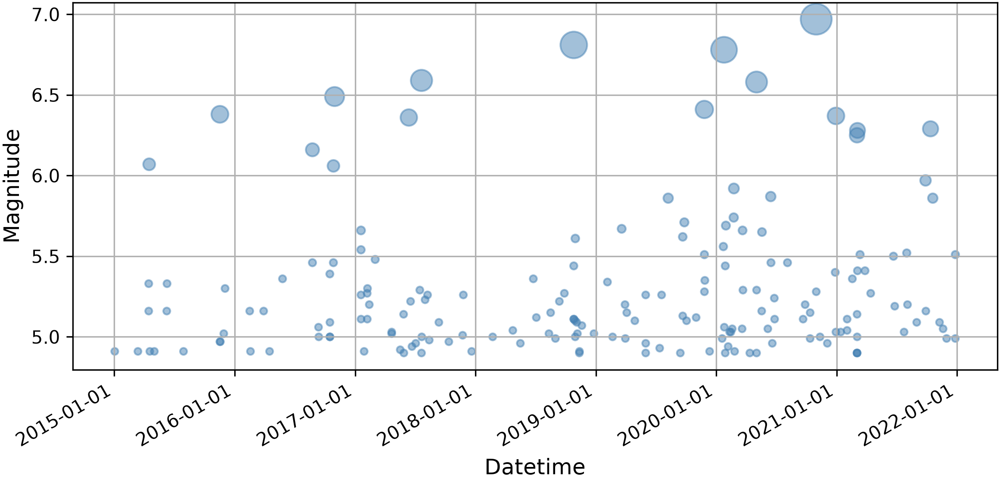
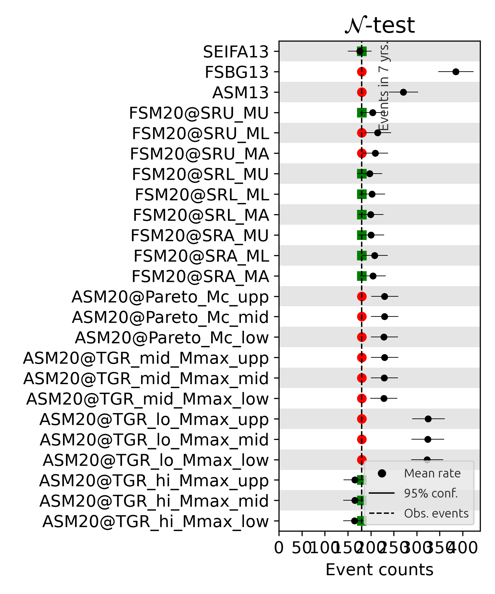
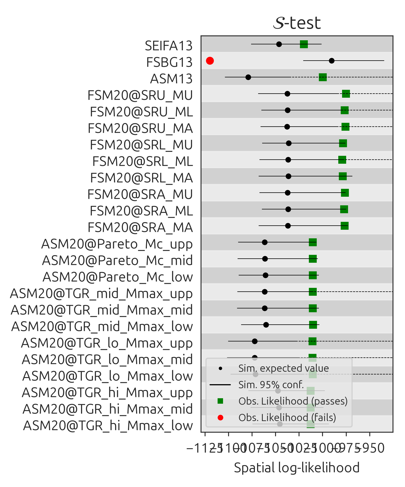
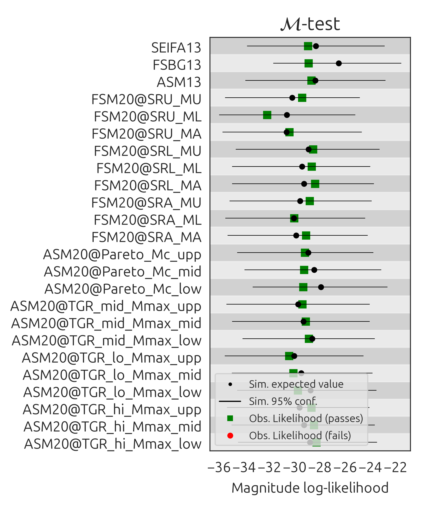
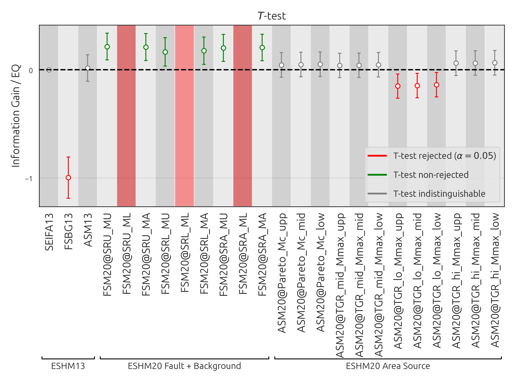

# ESHM20 Testing — Experiment Report

[](https://doi.org/10.5281/zenodo.21497355)

Prospective and pseudo-prospective evaluation of the earthquake rate models of the 2020 European Seismic Hazard Model (ESHM20), carried out with the Collaboratory for the Study of Earthquake Predicability (CSEP) testing framework and the software [floatCSEP](https://github.com/cseptesting/floatcsep).

- **Authors:** Pablo Iturrieta, José A. Bayona, Maximilian J. Werner, Fabrice Cotton, Graeme Weatherill, Laurentiu Danciu
- **Evaluation catalog:** EMEC ([10.5880/GFZ.EMEC.2021.001](https://doi.org/10.5880/GFZ.EMEC.2021.001)), provided by GFZ
- **Experiment class:** Pseudo-Prospective / Prospective, Time-Independent
- **Software:** floatCSEP v0.5.2, pyCSEP v0.8.0
- **Last run:** 2026-07-11
- **License:** CC BY 4.0

## Installation

```bash
conda env create -f environment.yml
conda activate testing_eshm20
```

 Alternatively, in an existing Python 3.12 environment:

```bash
pip install floatcsep==0.5.2
```

For an exact reconstruction of the environment install from the lock file instead:

```bash
pip install -r requirements-lock.txt
```

## Running the experiment

All commands are run from the repository root and take the experiment configuration as argument:

```bash
floatcsep run config.yml          # run the experiment end-to-end from scratch
floatcsep plot config.yml         # (re-)create figures and this report
floatcsep view config.yml         # deploy the interactive dashboard
floatcsep reproduce config.yml    # re-run and compare against the archived results
```

## Where to find the results

All output is written to the `results/` directory:

- **Report:** `results/report.md` and `results/report.pdf`.
- **Main catalog figures:** `results/catalog.png` (map) and `results/events.png` (time series).
- **Per-window outputs** in `results/2015-01-01_2022-01-01/`:
  - `catalog/test_catalog.json` — the test catalog used for the evaluations.
  - `evaluations/` — individual test results as JSON.
  - `figures/` — evaluation figures and forecast maps.
- **Reproducibility:** `floatcsep reproduce config.yml` writes a comparison against these archived results, including a `reproducibility_report.md`.

---

## Table of Contents
1. [Experiment metadata](#experiment_metadata)
1. [Objectives](#objectives)
1. [Forecast models](#forecast_models)
1. [Authoritative Data](#authoritative_data)
1. [Test results](#test_results)


## Experiment metadata <a id="experiment_metadata"></a>


- **Start date:** 2015-01-01 00:00:00
- **End date:** 2022-01-01 00:00:00
- **Class:** Time-Independent
- **Magnitude range:** 4.9 ≤ Mw ≤ 8.9
- **Region:** region_europe.txt
- **Catalog:** emec_catalog.json
- **Models:** SEIFA13, FSBG13, ASM13, FSM20@SRU_MU, FSM20@SRU_ML, FSM20@SRU_MA, FSM20@SRL_MU, FSM20@SRL_ML, FSM20@SRL_MA, FSM20@SRA_MU, FSM20@SRA_ML, FSM20@SRA_MA, ASM20@Pareto_Mc_upp, ASM20@Pareto_Mc_mid, ASM20@Pareto_Mc_low, ASM20@TGR_mid_Mmax_upp, ASM20@TGR_mid_Mmax_mid, ASM20@TGR_mid_Mmax_low, ASM20@TGR_lo_Mmax_upp, ASM20@TGR_lo_Mmax_mid, ASM20@TGR_lo_Mmax_low, ASM20@TGR_hi_Mmax_upp, ASM20@TGR_hi_Mmax_mid, ASM20@TGR_hi_Mmax_low
- **Evaluations:** Poisson_N, Poisson_S, Poisson_M, Poisson_T

## Objectives <a id="objectives"></a>


* Ensure transparent and reproducible evaluation of submitted models.
* Compare forecasts against authoritative seismicity observations.

## Forecast models <a id="forecast_models"></a>

The forecasts under evaluation are the branches of the ESHM20 seismogenic source model logic tree, complemented by the three source models of its predecessor, the 2013 European Seismic Hazard Model (ESHM13).



The ESHM20 source model combines two main branches with equal weight:

- **Area Source model (`ASM20`):** earthquake rates are defined within seismotectonic zones. The epistemic uncertainty in the magnitude-frequency distribution (MFD) is captured by two alternative forms: a **Pareto MFD**, sampled at three corner magnitudes (`ASM20@Pareto_Mc_upp/mid/low`), and a **double truncated Gutenberg–Richter MFD**, sampled at three activity-rate pairs (a, b: `hi`, `mid`, `lo`) combined with three maximum-magnitude branches (`Mmax_upp/mid/low`), yielding the nine `ASM20@TGR_*` forecasts. In total, 12 area-source branches.

- **Faults and Smoothed-Seismicity model (`FSM20`):** earthquake rates are derived from mapped fault sources combined with a smoothed-seismicity background. Its epistemic uncertainty is sampled through three fault slip-rate branches (`SRL`/`SRA`/`SRU`: lower/mean/upper) combined with three maximum-magnitude branches (`ML`/`MA`/`MU`: lower/mean/upper), yielding the nine `FSM20@SR*_M*` forecasts.

The three ESHM13 source models serve as reference points from the previous generation of the European hazard model: `ASM13` (area sources), `FSBG13` (fault sources and background), and `SEIFA13` (kernel-smoothed seismicity). `SEIFA13` is used as the reference model in the comparative T-test.

Rather than evaluating only the weighted-mean rate forecast, each terminal branch enters the experiment as an individual forecast. This allows testing not only the overall consistency of the source model with the observed seismicity, but also the relative information gain of each epistemic choice within the logic tree. However, work is pending to test the entire spread of the epistemic uncertainty. 

## Authoritative Data <a id="authoritative_data"></a>


### Input catalog  <a id="input_catalog"></a>






Evaluation catalog from 2015-01-01 00:00:00 until 2022-01-01 00:00:00. Earthquakes are filtered above Mw 4.9.
## Test results <a id="test_results"></a>


### Poisson_N  <a id="poisson_n"></a>





### Poisson_S  <a id="poisson_s"></a>





### Poisson_M  <a id="poisson_m"></a>





### Poisson_T  <a id="poisson_t"></a>


