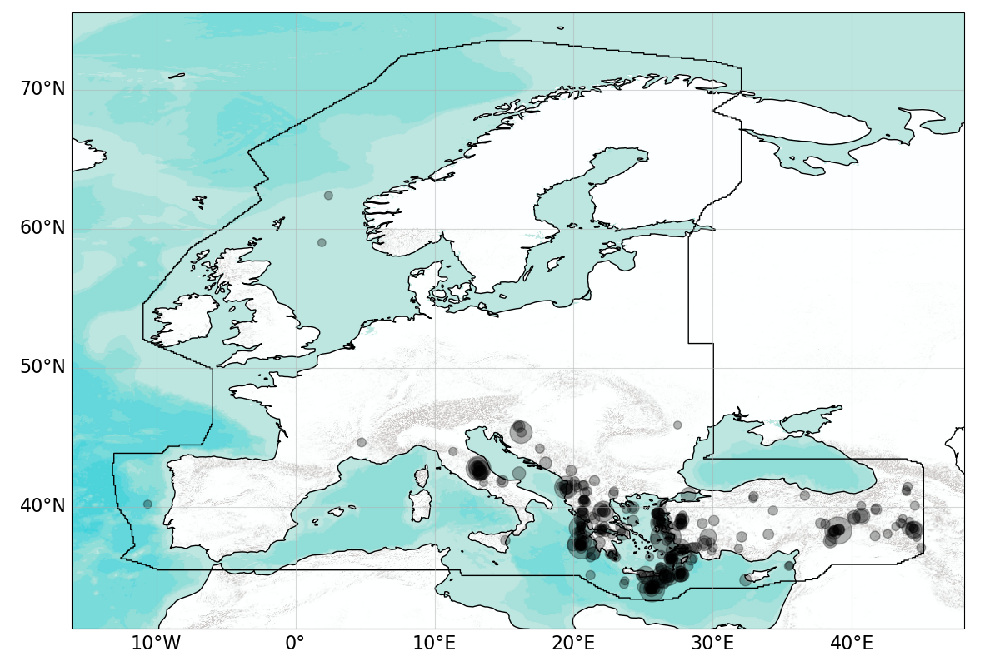
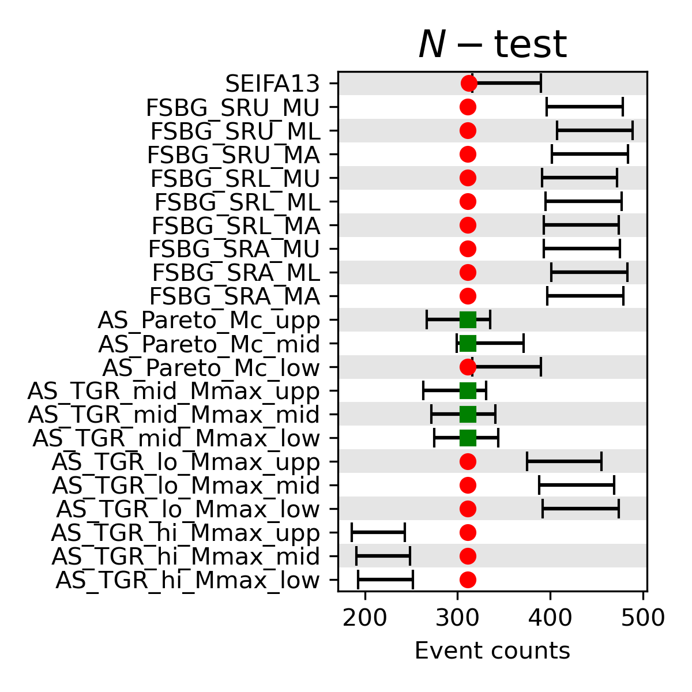
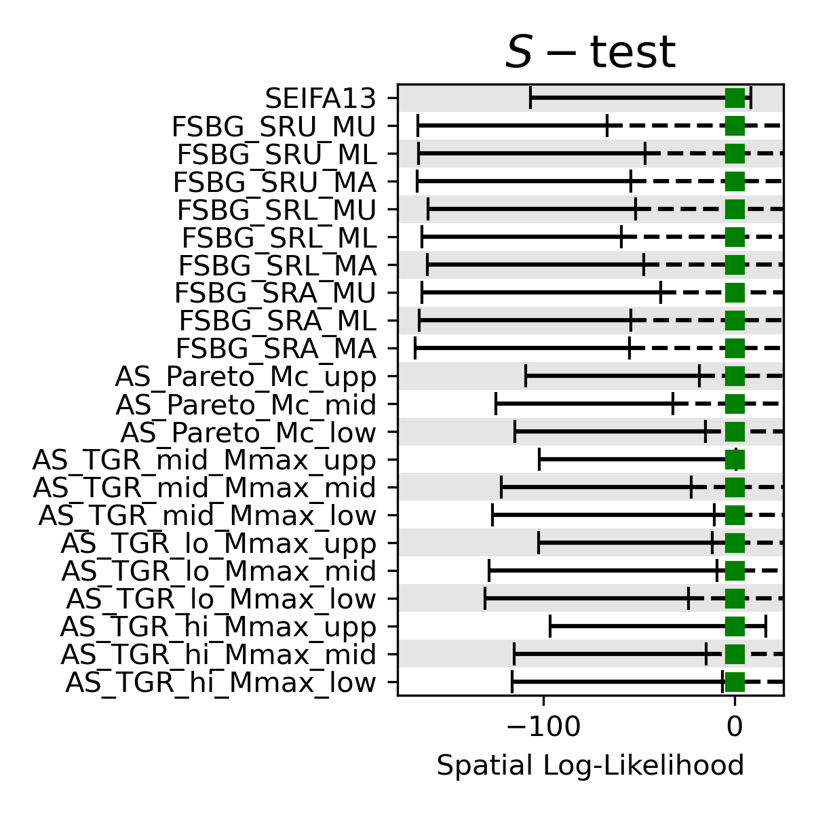
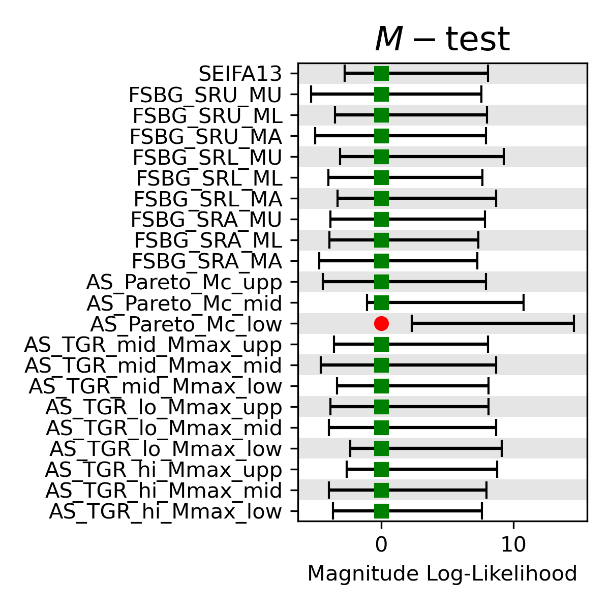
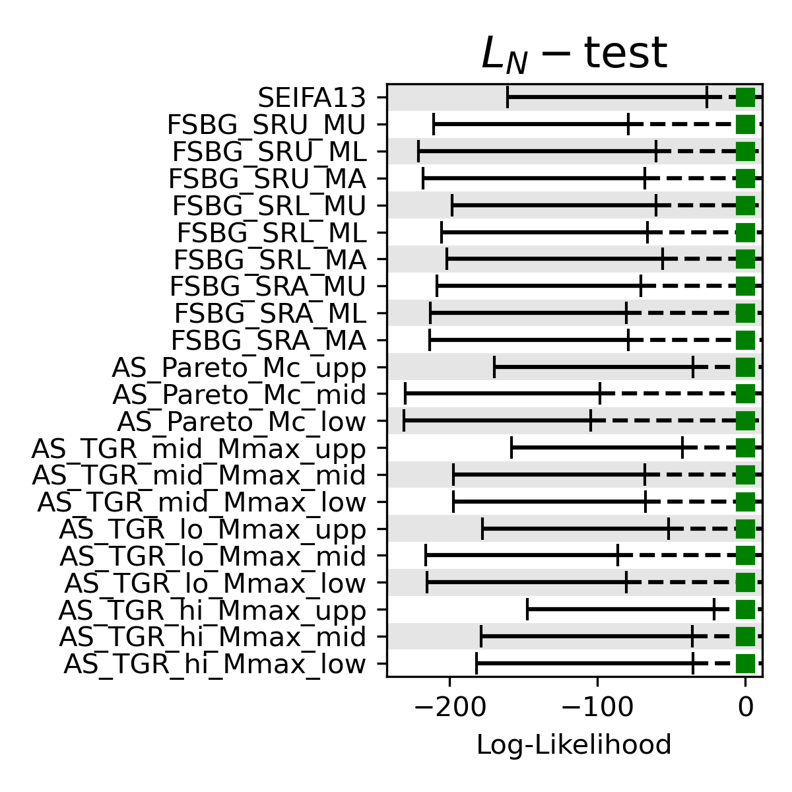
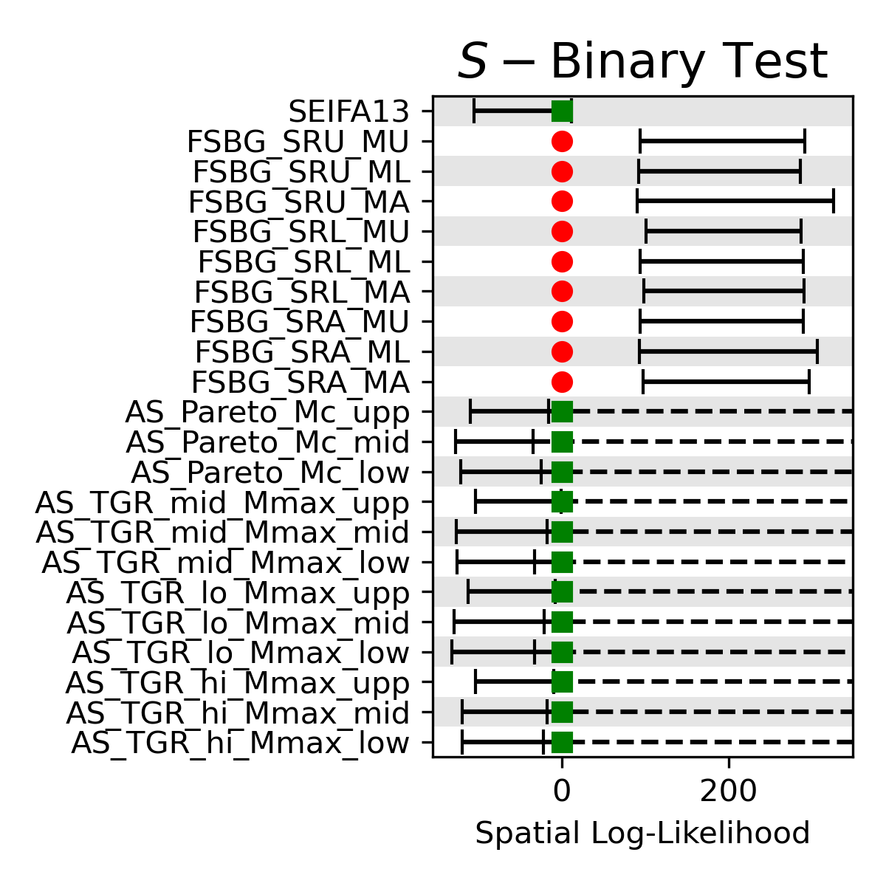
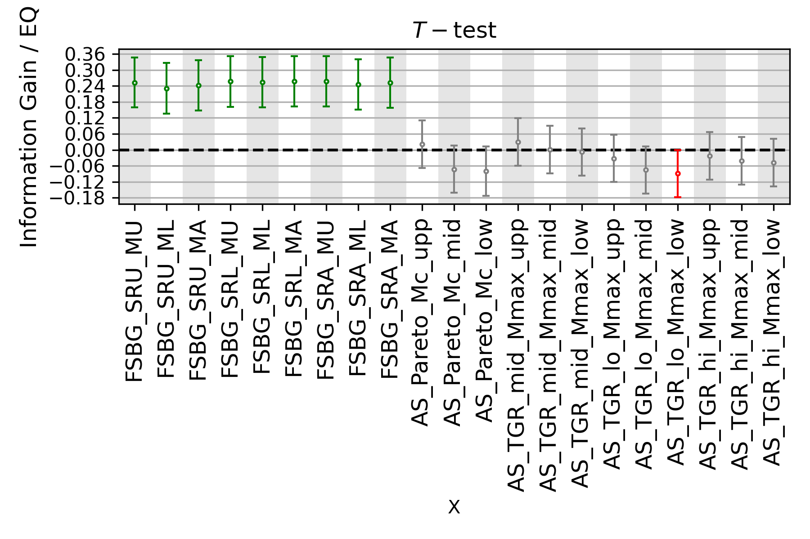

# Floating Experiment - EFEHR20 

# Table of Contents
   1. [Objectives](#objectives)
   1. [ISC gCMT Authoritative Catalog](#isc_gcmt_authoritative_catalog)
   1. [Results](#results)
      1. [Poisson_N](#poisson_n)
      1. [Poisson_S](#poisson_s)
      1. [Poisson_M](#poisson_m)
      1. [Poisson_CL](#poisson_cl)
      1. [Binary_S](#binary_s)
      1. [Poisson_T](#poisson_t)
## Objectives 

* Describe the predictive skills of posited hypothesis about seismogenesis with earthquakes of M4.75+ independent observations in Europe.
* Identify the methods and geophysical datasets that lead to the highest information gains in the latest release of the European Seismic Hazard Model.

## ISC gCMT Authoritative Catalog  

The authoritative evaluation data is the full Global CMT catalog (Ekström et al. 2012). We confine the hypocentral depths of earthquakes in training and testing datasets to a maximum of 70km. The plot shows the catalog for the testing period which ranges from 2015-01-01 00:00:00 until 2022-01-01 00:00:00. Earthquakes are filtered above Mw 4.7. Black circles depict individual earthquakes with its radius proportional to the magnitude.
## Results 

We apply the following tests to each of the forecasts considered in this gefe. More information regarding the tests can be found [here](https://docs.cseptesting.org/getting_started/theory.html).
* Poisson_N
* Poisson_S
* Poisson_M
* Poisson_CL
* Binary_S
* Poisson_T
### Poisson_N  

### Poisson_S  

### Poisson_M  

### Poisson_CL  

### Binary_S  

### Poisson_T  

