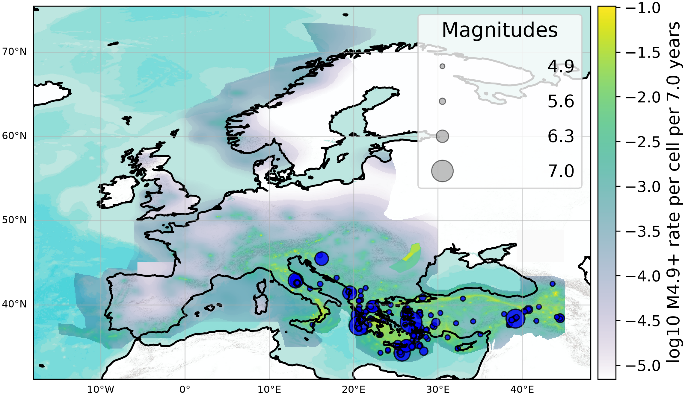
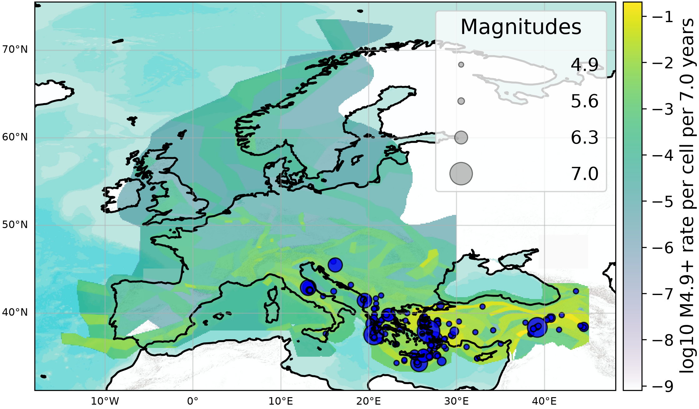
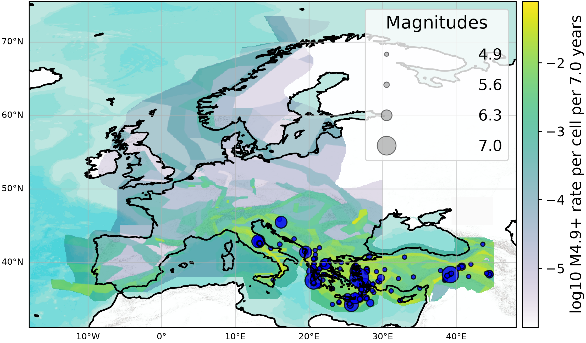
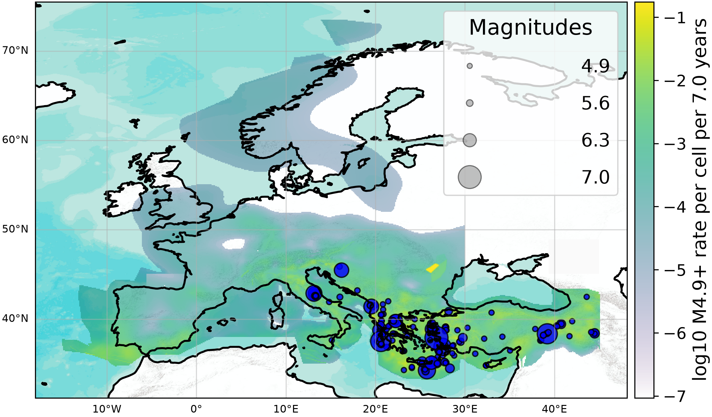
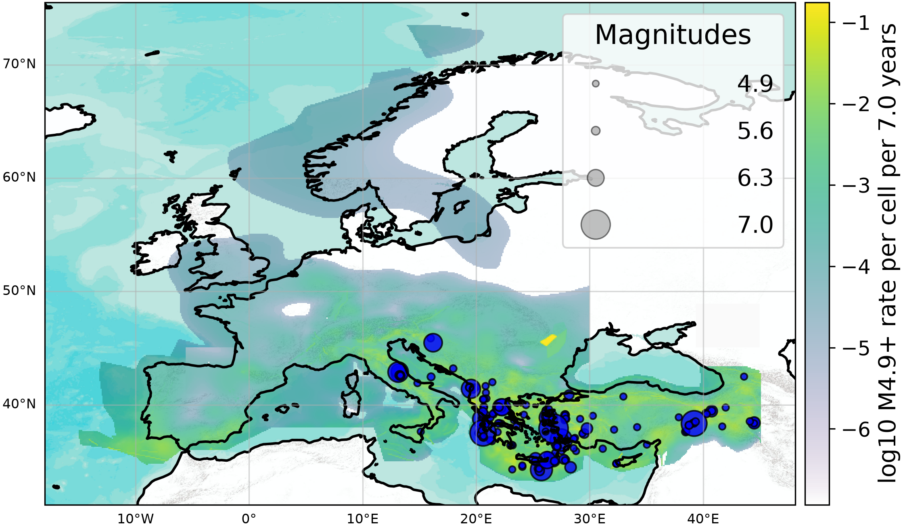
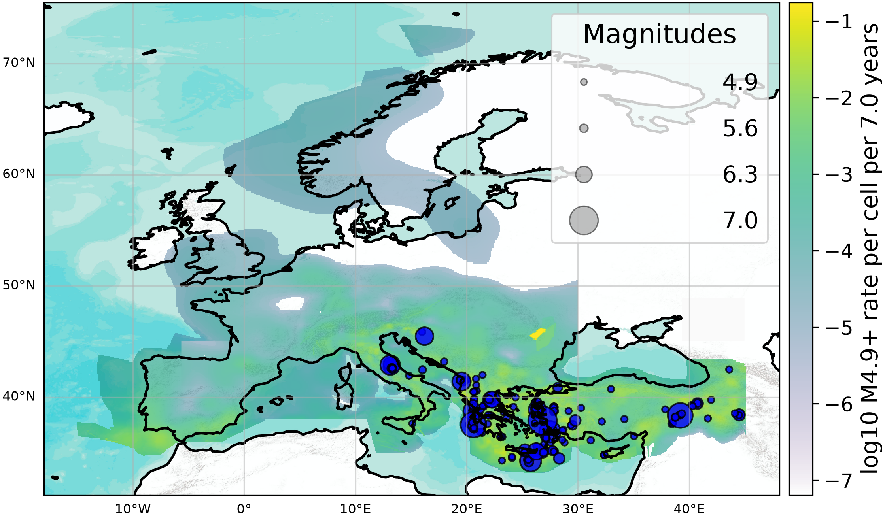
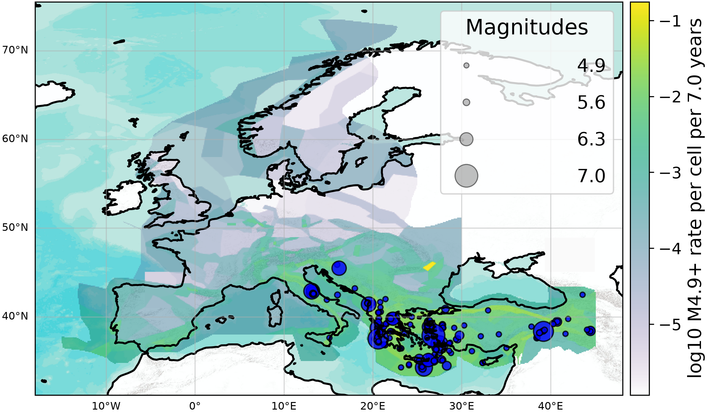
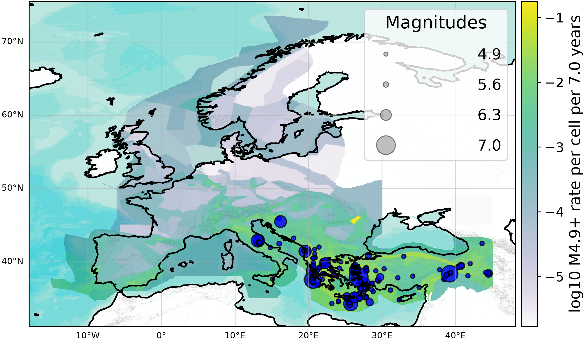
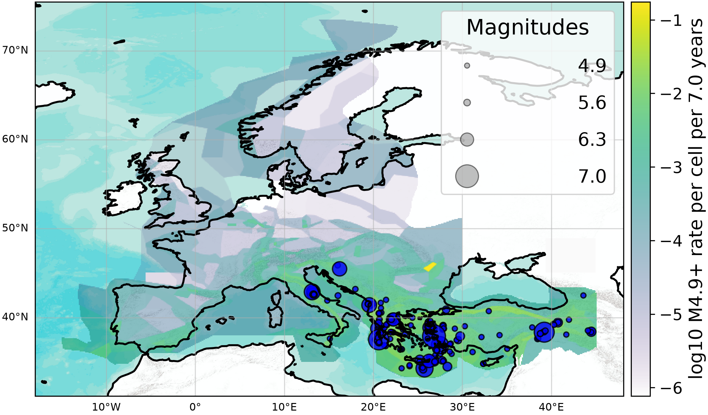

  
  <h1 style='margin:0;'>Experiment Report</h1>
  
ESHM20 Testing

## Table of Contents
1. [Experiment metadata](#experiment_metadata)
1. [Objectives](#objectives)
1. [Authoritative Data](#authoritative_data)
1. [Forecasts](#forecasts)
1. [Test results](#test_results)

This experiment evaluates the performance of earthquake forecast models within a fully specified and reproducible testing framework. This report summarizes the main results.

## Experiment metadata 

- **Start date:** 2015-01-01 00:00:00
- **End date:** 2022-01-01 00:00:00
- **Class:** Time-Independent
- **Magnitude range:** 4.9 ≤ Mw ≤ 8.9
- **Region:** region_europe.txt
- **Catalog:** emec_catalog.json
- **Models:** SEIFA13, FSBG13, ASM13, FSM20@SRU_MU, FSM20@SRU_ML, FSM20@SRU_MA, FSM20@SRL_MU, FSM20@SRL_ML, FSM20@SRL_MA, FSM20@SRA_MU, FSM20@SRA_ML, FSM20@SRA_MA, ASM20@Pareto_Mc_upp, ASM20@Pareto_Mc_mid, ASM20@Pareto_Mc_low, ASM20@TGR_mid_Mmax_upp, ASM20@TGR_mid_Mmax_mid, ASM20@TGR_mid_Mmax_low, ASM20@TGR_lo_Mmax_upp, ASM20@TGR_lo_Mmax_mid, ASM20@TGR_lo_Mmax_low, ASM20@TGR_hi_Mmax_upp, ASM20@TGR_hi_Mmax_mid, ASM20@TGR_hi_Mmax_low
- **Evaluations:** Poisson_N, Poisson_S, Poisson_M, Poisson_T

## Objectives 

* Ensure transparent and reproducible evaluation of submitted models.
* Compare forecasts against authoritative seismicity observations.

## Authoritative Data 

### Input catalog  

Evaluation catalog from 2015-01-01 00:00:00 until 2022-01-01 00:00:00. Earthquakes are filtered above Mw 4.9.
## Forecasts 

### SEIFA13  

### FSBG13  

### ASM13  

### FSM20@SRU_MU  

### FSM20@SRU_ML  

### FSM20@SRU_MA  

### FSM20@SRL_MU  

### FSM20@SRL_ML  

### FSM20@SRL_MA  

### FSM20@SRA_MU  

### FSM20@SRA_ML  

### FSM20@SRA_MA  

### ASM20@Pareto_Mc_upp  

### ASM20@Pareto_Mc_mid  

### ASM20@Pareto_Mc_low  

### ASM20@TGR_mid_Mmax_upp  

### ASM20@TGR_mid_Mmax_mid  

### ASM20@TGR_mid_Mmax_low  

### ASM20@TGR_lo_Mmax_upp  

### ASM20@TGR_lo_Mmax_mid  

### ASM20@TGR_lo_Mmax_low  

### ASM20@TGR_hi_Mmax_upp  

### ASM20@TGR_hi_Mmax_mid  

### ASM20@TGR_hi_Mmax_low  

## Test results 

### Poisson_N  

### Poisson_S  

### Poisson_M  

### Poisson_T  

